# BABS Icon Reference

262 civil-protection icons across 9 categories.
Labels in German (DE), French (FR) and Italian (IT).
For divergent icons (different graphic per language) all three variants are shown side by side.

---

## Contents

- [1 · Auswirkungen](#1--auswirkungen)
- [2 · Gefahren](#2--gefahren)
- [3 · Zivile Führungsstandorte](#3--zivile-f-hrungsstandorte)
- [4 · Formationen](#4--formationen)
- [5 · Einrichtungen im Einsatzraum](#5--einrichtungen-im-einsatzraum)
- [6 · Bewegungen](#6--bewegungen)
- [7 · Fahrzeuge](#7--fahrzeuge)
- [8 · Bildhafte Signaturen](#8--bildhafte-signaturen)
- [9 · Spezial](#9--spezial)

---

## 1 · Auswirkungen

**Auswirkungen** / Effets / Effetti

### 11 · Auswirkungen von Schadenereignissen auf Gebiete

_Auswirkungen von Schadenereignissen auf Gebiete / Effets d'événements dommageables sur le terrain et les objectifs / Effetti provocati da sinistri sul territorio e sugli obiettivi_

| Icon                                                   | ID      | Export                               | DE                                 | FR                                      | IT                                                    | Pattern                                                                                                              | Raster |
| --------------------------------------------------------------------------------------------------------- | ------- | ------------------------------------ | ---------------------------------- | --------------------------------------- | ----------------------------------------------------- | -------------------------------------------------------------------------------------------------------------------- | ------ |
|                        | `1101`  | `babsBeschaedigung`                  | Beschaedigung                      | Degat                                   | Danneggiamento                                        |                                                                                                                      |        |
|                      | `1102`  | `babsTeilzerstoerung`                | Teilzerstoerung                    | Destruction-partielle                   | Distruzione-parziale                                  |                                                                                                                      |        |
|                     | `1103`  | `babsTotalzerstoerung`               | Totalzerstoerung                   | Destruction-totale                      | Distruzione-totale                                    |                                                                                                                      |        |
|      | `1104`  | `babsBrandEinzelnesGebaeudeFlamme`   | Brand-einzelnes-Gebaeude-Flamme    | Incendie-isole                          | Incendio-di-un-singolo-edificio                       |                                                                                                                      |        |
| 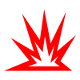                     | `1105a` | `babsExplosionsherd`                 | Explosionsherd                     | Foyer-d-explosion                       | Focolaio-esplosione                                   |                                                                                                                      |        |
| 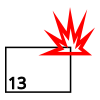            | `1105b` | `babsExplosionsherdBeispiel`         | Explosionsherd-Beispiel            | Foyer-d-explosion-exemple               | Focolaio-esplosione-esempio                           |                                                                                                                      |        |
| 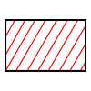 | `1106a` | `babsBrandEinzelnesGebaeudeSignatur` | Brand einzelnes Gebäude - Signatur | Incendie d'un bâtiment isolé            | Incendio di un singolo edificio                       |                                                                                                                      | ✓      |
|  | `1106b` | `babsBrandEinzelnesGebaeudeBeispiel` | Brand einzelnes Gebäude - Beispiel | Incendie d'un bâtiment isolé-exemple    | Incendio di un singolo edificio-esempio               |                                                                                                                      | ✓      |
|   | `1107a` | `babsBrandMehrererGebaeudeSignatur`  | Brand mehrerer Gebäude - Signatur  | Incendie de plusieurs bâtiments         | Incendio di diversi edifici vicini                    |                                                                                                                      | ✓      |
|   | `1107b` | `babsBrandMehrererGebaeudeBeispiel`  | Brand mehrerer Gebäude - Beispiel  | Incendie de plusieurs bâtiments-exemple | Incendio di diversi edifici vicini-esempio            |                                                                                                                      | ✓      |
|     | `1108`  | `babsBranduebergriffsgefahrBeispiel` | Brandübergriffsgefahr - Beispiel   | Danger d'extension du feu-exemple       | Direzione della propagazione dell'incendio-esempio    |                                                                                                                      | ✓      |
| 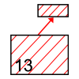   | `1109`  | `babsBranduebergriffErfolgtBeispiel` | Brandübergriff erfolgt - Beispiel  | Extension du feu-exemple                | Propagazione avvenuta-esempio                         |                                                                                                                      | ✓      |
| 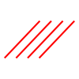              | `1110`  | `babsBrandzoneFlaechenbrand`         | Brandzone Flächenbrand             | Zone en feu                             | Zona toccata dall’incendio                            |          | ✓      |
| 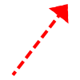   | `1111a` | `babsBranduebergriffsgefahrSignatur` | Brandübergriffsgefahr - Signatur   | Danger d'extension du feu               | Pericolo di propagazione dell'incendio                |                                                                                                                      | ✓      |
|   | `1111b` | `babsBranduebergriffErfolgtSignatur` | Brandübergriff erfolgt - Signatur  | Extension du feu                        | Propagazione avvenuta                                 |                                                                                                                      | ✓      |
|       | `1112`  | `babsZerstoerteZoneEinerOrtschaft`   | Zerstörte Zone einer Ortschaft     | Zone sinistrée impraticable             | Zona sinistrata impraticabile                         | 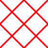 | ✓      |
|                         | `1113`  | `babsRutschgebiet`                   | Rutschgebiet                       | Glissement de terrain avec direction    | Zona colpita da frana con indicazione della direzione | 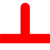                   | ✓      |
| 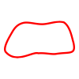         | `1114`  | `babsSchadengebietSchadenraum`       | Schadengebiet - Schadenraum        | Zone de dégâts                          | Zona sinistrata                                       |                                                                                                                      | ✓      |
|                | `1115`  | `babsUeberschwemmtesGebiet`          | Überschwemmtes Gebiet              | Zone inondée avec direction du flux     | Zona inondata con indicazione della direzione         |                                                                                                                      | ✓      |
|           | `1116a` | `babsTruemmerbereichSignatur`        | Trümmerbereich - Signatur          | Zone de décombre                        | Zona macerie                                          |                                                                                                                      | ✓      |
| 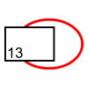          | `1116b` | `babsTruemmerbereichBeispiel`        | Trümmerbereich - Beispiel          | Zone de décombre-exemple                | Zona macerie-esempio                                  |                                                                                                                      | ✓      |

### 12 · Auswirkungen von Schadenereignissen auf Verkehrswege

_Auswirkungen von Schadenereignissen auf Verkehrswege / Effets d'événements dommageables sur les voies de communication / Effetti provocati da sinistri sulle vie di comunicazione_

| Icon                                                     | ID     | Export                                | DE                                    | FR                              | IT                                    | Pattern                                                                                                           | Raster |
| ----------------------------------------------------------------------------------------------------------- | ------ | ------------------------------------- | ------------------------------------- | ------------------------------- | ------------------------------------- | ----------------------------------------------------------------------------------------------------------------- | ------ |
|     | `1201` | `babsStrErschwertBefahrbarBegehbar`   | Str erschwert befahrbar - begehbar    | Route difficilement praticable  | Strada percorribile                   |                                                                                                                   | ✓      |
|  | `1202` | `babsStrNichtBefahrbarSchwerBegehbar` | Str nicht befahrbar - schwer begehbar | Route impraticable pour les vhc | Strada non percorribile per i veicoli |                                                                                                                   | ✓      |
|            | `1203` | `babsStrUnpassierbarGesperrt`         | Str unpassierbar - gesperrt           | Route impraticable-barrée       | Strada impraticabile-sbarrata         |  | ✓      |

### 13 · Auswirkungen von Schadenereignissen auf Personen

_Auswirkungen von Schadenereignissen auf Personen / Effets d'événements dommageables sur les personnes / Effetti provocati da sinistri sulle persone_

| Icon                            | ID     | Export             | DE           | FR        | IT                   | Pattern | Raster |
| ---------------------------------------------------------------------------------- | ------ | ------------------ | ------------ | --------- | -------------------- | ------- | ------ |
|     | `1301` | `babsVerletzte`    | Verletzte    | Blesses   | Feriti               |         |        |
|     | `1302` | `babsVermisste`    | Vermisste    | Disparus  | Dispersi             |         |        |
| 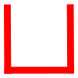   | `1303` | `babsObdachlose`   | Obdachlose   | Sans-abri | Senzatetto           |         |        |
| 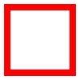 | `1304` | `babsEingesperrte` | Eingesperrte | Enfermes  | Persone-imprigionate |         |        |
|          | `1305` | `babsTote`         | Tote         | Morts     | Morti                |         |        |

### 14 · Auswirkungen von Schadenereignissen auf Gebiete Gelb

_Auswirkungen von Schadenereignissen auf Gebiete Gelb / Effets d'événements dommageables sur le terrain / Effetti provocati da sinistri sul territorio_

| Icon                                                                         | ID      | Export                                                   | DE                                                       | FR                                                        | IT                                             | Pattern | Raster |
| ------------------------------------------------------------------------------------------------------------------------------- | ------- | -------------------------------------------------------- | -------------------------------------------------------- | --------------------------------------------------------- | ---------------------------------------------- | ------- | ------ |
| 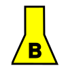                             | `1401`  | `babsBiologischVerseuchtesGebiet`                        | Biologisch verseuchtes Gebiet                            | Zone biologiquement contaminée                            | Zona infettata                                 |         | ✓      |
| 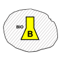                 | `1401b` | `babsBiologischVerseuchtesGebietBeispiel`                | Biologisch verseuchtes Gebiet - Beispiel                 | Zone biologiquement contaminée - example                  | Zona infettata - Esempio                       |         | ✓      |
|                   | `1402`  | `babsChemievergifteteZoneFluessigSesshaft`               | Chemievergiftete Zone flüssig - sesshaft                 | Zone chimiquement contaminée sous forme liquide           | Zona intossicata liquido-persistente           |         |        |
|       | `1402b` | `babsChemievergifteteZoneFluessigSesshaftBeispiel`       | Chemievergiftete Zone flüssig - sesshaft - Beispiel      | Zone chimiquement contaminée sous forme liquide - example | Zona intossicata liquido-persistente - Esempio |         | ✓      |
| 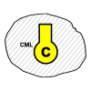             | `1403`  | `babsChemievergiftetesGebietGasfoermigFluechtig`         | Chemievergiftetes Gebiet gasförmig - flüchtig            | Zone chimiquement contaminée sous forme gazeuse           | Zona intossicata gas-volatile                  |         |        |
|  | `1403b` | `babsChemievergiftetesGebietGasfoermigFluechtigBeispiel` | Chemievergiftetes Gebiet gasförmig - flüchtig - Beispiel | Zone chimiquement contaminée sous forme gazeuse - example | Zona intossicata gas-volatile - Esempio        |         | ✓      |
|                                        | `1404`  | `babsRadioaktivesGebiet`                                 | Radioaktives Gebiet                                      | Zone radioactive                                          | Zona contaminata radioattività                 |         |        |
| 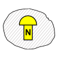                           | `1404b` | `babsRadioaktivesGebietBeispiel`                         | Radioaktives Gebiet - Beispiel                           | Zone radioactive - example                                | Zona contaminata radioattività - Esempio       |         | ✓      |

---

## 2 · Gefahren

**Gefahren** / Dangers / Pericoli

| Icon                                                                                                                                                                                                                                            | ID      | Export                             | DE                              | FR                               | IT                                        | Pattern | Raster |
| --------------------------------------------------------------------------------------------------------------------------------------------------------------------------------------------------------------------------------------------------------------------------------------------------- | ------- | ---------------------------------- | ------------------------------- | -------------------------------- | ----------------------------------------- | ------- | ------ |
| 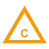                                                                                                                                                                                                            | `2101`  | `babsChemikalienGefahr`            | Chemikalien Gefahr              | Danger chimique                  | Pericolo sostanze chimiche                |         |        |
| 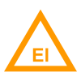                                                                                                                                                                                                           | `2102`  | `babsElektrizitaetGefahr`          | Elektrizität Gefahr             | Danger électrique                | Pericolo ellettricità                     |         |        |
|                                                                                                                                                                                                               | `2103`  | `babsExplosionGefahr`              | Explosion Gefahr                | Danger d'explosion               | Pericolo esplosione                       |         |        |
|                                                                                                                                                                                                                     | `2104`  | `babsGasGefahr`                    | Gas Gefahr                      | Danger de gaz                    | Pericolo gas                              |         |        |
| &nbsp;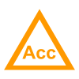&nbsp; | `2105`  | `babsUnfallGefahr`                 | Unfall Gefahr                   | Danger d'accident                | Pericolo Incidente                        |         |        |
| 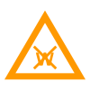                                                                                                                                                                                               | `2106`  | `babsGefahrDurchLoeschenMitWasser` | Gefahr durch Löschen mit Wasser | Danger-si-extinction-avec-eau    | Pericolo in caso di spegnimento con acqua |         |        |
| 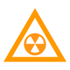                                                                                                                                                                                                     | `2107`  | `babsRadioaktiveStoffeGefahr`      | Radioaktive Stoffe Gefahr       | Danger substances-radioactives   | Pericolo sostanze radioattive             |         |        |
| 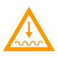                                                                                                                                                                                                        | `2108`  | `babsGefahrFuerGrundwasser`        | Gefahr für Grundwasser          | Danger-pour-les-eaux de surface  | Pericolo per le acque in superficie       |         |        |
|                                                                                                                                                                                                  | `2109a` | `babsGefahrentafelOhneUNNummer`    | Gefahrentafel ohne UN-Nummer    | Plaque de danger sans numéro ONU | Pannello di pericolo senza numero ONU     |         | ✓      |
| 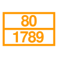                                                                                                                                                                                                  | `2109b` | `babsGefahrentafelMitUNNummer`     | Gefahrentafel mit UN-Nummer     | Plaque de danger avec numéro ONU | Pannello di pericolo con numero ONU       |         | ✓      |

---

## 3 · Zivile Führungsstandorte

**Zivile Führungsstandorte** / Emplacements de conduite civils / Ubicazioni di condotta civili

| Icon                                                                                                                                                                                                                                                                             | ID     | Export                             | DE                          | FR                             | IT                              | Pattern | Raster |
| ------------------------------------------------------------------------------------------------------------------------------------------------------------------------------------------------------------------------------------------------------------------------------------------------------------------------------------ | ------ | ---------------------------------- | --------------------------- | ------------------------------ | ------------------------------- | ------- | ------ |
| 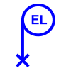&nbsp;&nbsp;                      | `3101` | `babsEinsatzleitung`               | Einsatzleitung              | Direction d'intervention       | Direzione d'intervento          |         |        |
| 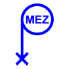&nbsp;&nbsp;    | `3102` | `babsMobileEinsatzzentrale`        | Mobile Einsatzzentrale      | Centrale d'engagement mobile   | Centrale d'intervento mobile    |         |        |
| &nbsp;&nbsp;                          | `3103` | `babsKommandopostenFront`          | Kommandoposten Front        | PC engagement                  | Posto di comando fronte         |         |        |
| 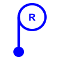&nbsp;&nbsp;                 | `3104` | `babsKommandopostenRueckwaertiges` | Kommandoposten Rückwärtiges | PC opérations                  | Posto di comando retrovie       |         |        |
| &nbsp;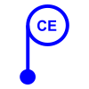&nbsp;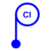                         | `3105` | `babsEinsatzzentrale`              | Einsatzzentrale             | Centrale d'engagement          | Centrale d'intervento           |         |        |
| &nbsp;&nbsp;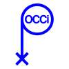           | `3106` | `babsZivilesFuehrungsorgan`        | Ziviles Führungsorgan       | Organe de conduite civile      | Organo di condotta civile       |         |        |
| &nbsp;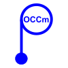&nbsp;       | `3107` | `babsGemeindefuehrungsorgan`       | Gemeindeführungsorgan       | Organe de conduite communal    | Organo di condotta comunale     |         |        |
| &nbsp;&nbsp;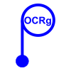   | `3108` | `babsRegionalesFuehrungsorgan`     | Regionales Führungsorgan    | Organe de conduite régional    | Organo di condotta regionale    |         |        |
| &nbsp;&nbsp; | `3109` | `babsBezirksfuehrungsorgan`        | Bezirksführungsorgan        | Organe de conduite de district | Organo di condotta distrettuale |         |        |
| &nbsp;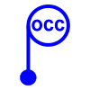&nbsp;   | `3110` | `babsKantonalesFuehrungsorgan`     | Kantonales Führungsorgan    | Organe de conduite cantonal    | Organo di condotta cantonale    |         |        |

---

## 4 · Formationen

**Formationen** / Formations / Formazione

### 41 · Polizei

_Polizei / Police / Polizia_

| Icon                                    | ID     | Export                    | DE                   | FR                         | IT                      | Pattern | Raster |
| ------------------------------------------------------------------------------------------ | ------ | ------------------------- | -------------------- | -------------------------- | ----------------------- | ------- | ------ |
|               | `4101` | `babsTruppP`              | Trupp-P              | Equipe-P                   | Squadra-P               |         |        |
|              | `4102` | `babsGruppeP`             | Gruppe-P             | Groupe-P                   | Gruppo-P                |         |        |
|                 | `4103` | `babsZugP`                | Zug-P                | Section-P                  | Sezione-P               |         |        |
|            | `4104` | `babsKompanieP`           | Kompanie-P           | Companie-P                 | Compania-P              |         |        |
|           | `4105` | `babsBataillonP`          | Bataillon-P          | Bataillon-P                | Bataillone-P            |         |        |
|       | `4106` | `babsEinsatzleiterP`      | Einsatzleiter-P      | DI-P                       | Capointervento-P        |         |        |
| 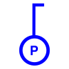      | `4107` | `babsGruppenfuehrerP`     | Gruppenführer-P      | Chef de groupe-P           | Cappogruppo-P           |         |        |
| 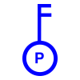 | `4108` | `babsOffizierZugfuehrerP` | Offizier-Zugführer-P | Officier-Chef de section-P | Uffiziale-Caposezione-P |         |        |

### 42 · Feuerwehr

_Feuerwehr / Pompier / Pompieri_

| Icon                                                                                                                                                                                                                                                                    | ID     | Export                     | DE                    | FR                          | IT                       | Pattern | Raster |
| --------------------------------------------------------------------------------------------------------------------------------------------------------------------------------------------------------------------------------------------------------------------------------------------------------------------------- | ------ | -------------------------- | --------------------- | --------------------------- | ------------------------ | ------- | ------ |
| &nbsp;&nbsp;                                              | `4201` | `babsTruppFW`              | Trupp-FW              | Equipe-SP                   | Squadra-CP               |         |        |
| &nbsp;&nbsp;                                              | `4202` | `babsGruppeFW`             | Gruppe-FW             | Groupe-SP                   | Gruppo-CP                |         |        |
| &nbsp;&nbsp;                                               | `4203` | `babsZugFW`                | Zug-FW                | Section-SP                  | Sezione-CP               |         |        |
| &nbsp;&nbsp;                                        | `4204` | `babsKompanieFW`           | Kompanie-FW           | Companie-SP                 | Compania-CP              |         |        |
| &nbsp;&nbsp;                                    | `4205` | `babsBataillonFW`          | Bataillon-FW          | Bataillon-SP                | Bataillone-CP            |         |        |
| &nbsp;&nbsp;                                   | `4206` | `babsEinsatzleiterFW`      | Einsatzleiter-FW      | DI-SP                       | Capointervento-CP        |         |        |
| &nbsp;&nbsp;                          | `4207` | `babsGruppenfuehrerFW`     | Gruppenführer-FW      | Chef de groupe-SP           | Cappogruppo-CP           |         |        |
| &nbsp;&nbsp; | `4208` | `babsOffizierZugfuehrerFW` | Offizier-Zugführer-FW | Officier-Chef de section-SP | Uffiziale-Caposezione-CP |         |        |

### 43 · Sanitätsdienst

_Sanitätsdienst / Santé publique / Sanità pubblica_

| Icon                                      | ID     | Export                      | DE                     | FR                           | IT                        | Pattern | Raster |
| -------------------------------------------------------------------------------------------- | ------ | --------------------------- | ---------------------- | ---------------------------- | ------------------------- | ------- | ------ |
|               | `4301` | `babsTruppSan`              | Trupp-San              | Equipe-San                   | Squadra-San               |         |        |
|              | `4302` | `babsGruppeSan`             | Gruppe-San             | Groupe-San                   | Gruppo-San                |         |        |
|                 | `4303` | `babsZugSan`                | Zug-San                | Section-San                  | Sezione-San               |         |        |
|            | `4304` | `babsKompanieSan`           | Kompanie-San           | Companie-San                 | Compania-San              |         |        |
|           | `4305` | `babsBataillonSan`          | Bataillon-San          | Bataillon-San                | Bataillone-San            |         |        |
|       | `4306` | `babsEinsatzleiterSan`      | Einsatzleiter-San      | DI-San                       | Capointervento-San        |         |        |
|       | `4307` | `babsGruppenfuehrerSan`     | Gruppenführer-San      | Chef de groupe-San           | Cappogruppo-San           |         |        |
|  | `4308` | `babsOffizierZugfuehrerSan` | Offizier-Zugführer-San | Officier-Chef de section-San | Uffiziale-Caposezione-San |         |        |

### 44 · Zivilschutz

_Zivilschutz / PCi / PCi_

| Icon                                                                                                                                                                                                                                                                      | ID     | Export                     | DE                    | FR                           | IT                        | Pattern | Raster |
| ----------------------------------------------------------------------------------------------------------------------------------------------------------------------------------------------------------------------------------------------------------------------------------------------------------------------------- | ------ | -------------------------- | --------------------- | ---------------------------- | ------------------------- | ------- | ------ |
| &nbsp;&nbsp;                                              | `4401` | `babsTruppZS`              | Trupp-ZS              | Equipe-PCi                   | Squadra-PCi               |         |        |
| &nbsp;&nbsp;                                              | `4402` | `babsGruppeZS`             | Gruppe-ZS             | Groupe-PCi                   | Gruppo-PCi                |         |        |
| &nbsp;&nbsp;                                               | `4403` | `babsZugZS`                | Zug-ZS                | Section-PCi                  | Sezione-PCi               |         |        |
| &nbsp;&nbsp;                                        | `4404` | `babsKompanieZS`           | Kompanie-ZS           | Companie-PCi                 | Compania-PCi              |         |        |
| &nbsp;&nbsp;                                    | `4405` | `babsBataillonZS`          | Bataillon-ZS          | Bataillon-PCi                | Bataillone-PCi            |         |        |
| 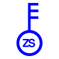&nbsp;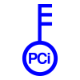&nbsp;                                   | `4406` | `babsEinsatzleiterZS`      | Einsatzleiter-ZS      | DI-PCi                       | Capointervento-PCi        |         |        |
| &nbsp;&nbsp;                          | `4407` | `babsGruppenfuehrerZS`     | Gruppenführer-ZS      | Chef de groupe-PCi           | Cappogruppo-PCi           |         |        |
| 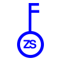&nbsp;&nbsp; | `4408` | `babsOffizierZugfuehrerZS` | Offizier-Zugführer-ZS | Officier-Chef de section-PCi | Uffiziale-Caposezione-PCi |         |        |

### 45 · Techn B

_Techn B / Services techn / Servizi tecnici_

| Icon                                                                                                                                                                                                                                                                              | ID     | Export                         | DE                        | FR                             | IT                          | Pattern | Raster |
| ------------------------------------------------------------------------------------------------------------------------------------------------------------------------------------------------------------------------------------------------------------------------------------------------------------------------------------- | ------ | ------------------------------ | ------------------------- | ------------------------------ | --------------------------- | ------- | ------ |
| &nbsp;&nbsp;                                              | `4501` | `babsTruppTechnB`              | Trupp-TechnB              | Equipe-S tec                   | Squadra-S tec               |         |        |
| &nbsp;&nbsp;                                              | `4502` | `babsGruppeTechnB`             | Gruppe-TechnB             | Groupe-S tec                   | Gruppo-S tec                |         |        |
| &nbsp;&nbsp;                                                | `4503` | `babsZugTechn`                 | Zug-Techn                 | Section-S tec                  | Sezione-S tec               |         |        |
| &nbsp;&nbsp;                                        | `4504` | `babsKompanieTechnB`           | Kompanie-TechnB           | Companie-S tec                 | Compania-S tec              |         |        |
| &nbsp;&nbsp;                                    | `4505` | `babsBataillonTechnB`          | Bataillon-TechnB          | Bataillon-S tec                | Bataillone-S tec            |         |        |
| 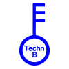&nbsp;&nbsp;                                    | `4506` | `babsEinsatzleiterTechB`       | Einsatzleiter-TechB       | DI-S tec                       | Capointervento-S tec        |         |        |
| 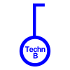&nbsp;&nbsp;                          | `4507` | `babsGruppenfuehrerTechnB`     | Gruppenführer-TechnB      | Chef de groupe-S tec           | Cappogruppo-S tec           |         |        |
| &nbsp;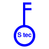&nbsp; | `4508` | `babsOffizierZugfuehrerTechnB` | Offizier-Zugführer-TechnB | Officier-Chef de section-S tec | Uffiziale-Caposezione-S tec |         |        |

### 46 · Armee

_Armee / Armée / Esercito_

| Icon                                                                                                                                                                                                                                                                    | ID     | Export                    | DE                     | FR                         | IT                       | Pattern | Raster |
| --------------------------------------------------------------------------------------------------------------------------------------------------------------------------------------------------------------------------------------------------------------------------------------------------------------------------- | ------ | ------------------------- | ---------------------- | -------------------------- | ------------------------ | ------- | ------ |
| &nbsp;&nbsp;                                                | `4601` | `babsTruppA`              | Trupp-A                | Equipe-A                   | Squadra-Es               |         |        |
| &nbsp;&nbsp;                                                | `4602` | `babsGruppeA`             | Gruppe-A               | Groupe-A                   | Gruppo-Es                |         |        |
| &nbsp;&nbsp;                                                 | `4603` | `babsZugA`                | Zug-A                  | Section-A                  | Sezione-Es               |         |        |
| &nbsp;&nbsp;                                          | `4604` | `babsKompanieA`           | Kompanie-A             | Companie-A                 | Compania-Es              |         |        |
| &nbsp;&nbsp;                                      | `4605` | `babsBataillonA`          | Bataillon-A            | Bataillon-A                | Bataillone-Es            |         |        |
| &nbsp;&nbsp;                                     | `4606` | `babsEinsatzleiterA`      | Einsatzleiter-A        | DI-A                       | Capointervento-Es        |         |        |
| 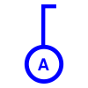&nbsp;&nbsp;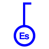                            | `4607` | `babsGruppenfuehrerA`     | Gruppenführer-A        | Chef de groupe-A           | Cappogruppo-Es           |         |        |
| 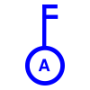&nbsp;&nbsp;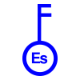 | `4608` | `babsOffizierZugfuehrerA` | Offizier - Zugführer-A | Officier-Chef de section-A | Uffiziale-Caposezione-Es |         |        |

### 47 · Partner ohne Hierarchiestufe

_Partner ohne Hierarchiestufe / Partenaires sans hiérarchie / Partner non gerarchiche_

| Icon                                                                                                                                                                                                            | ID     | Export              | DE     | FR    | IT    | Pattern | Raster |
| ------------------------------------------------------------------------------------------------------------------------------------------------------------------------------------------------------------------------------------------------------------------- | ------ | ------------------- | ------ | ----- | ----- | ------- | ------ |
|                                                                                                                                                                                              | `4701` | `babsPartnerP`      | P      | P     | P     |         |        |
| &nbsp;&nbsp;           | `4702` | `babsPartnerFW`     | FW     | SP    | CP    |         |        |
|                                                                                                                                                                                            | `4703` | `babsPartnerSan`    | San    | San   | San   |         |        |
| &nbsp;&nbsp;         | `4704` | `babsPartnerZS`     | ZS     | PCi   | PCi   |         |        |
| &nbsp;&nbsp; | `4705` | `babsPartnerTechnB` | TechnB | S tec | S tec |         |        |
| &nbsp;&nbsp;             | `4706` | `babsPartnerA`      | A      | A     | Es    |         |        |

### 48 · Hierarchiestufe ohne Partner

_Hierarchiestufe ohne Partner / Hiérarchies sans partenaire / Gerarchie senza partner_

| Icon                                  | ID     | Export                   | DE                 | FR                       | IT                    | Pattern | Raster |
| ---------------------------------------------------------------------------------------- | ------ | ------------------------ | ------------------ | ------------------------ | --------------------- | ------- | ------ |
|               | `4801` | `babsTrupp`              | Trupp              | Equipe                   | Squadra               |         |        |
|              | `4802` | `babsGruppe`             | Gruppe             | Groupe                   | Gruppo                |         |        |
|                 | `4803` | `babsZug`                | Zug                | Section                  | Sezione               |         |        |
|            | `4804` | `babsKompanie`           | Kompanie           | Companie                 | Compania              |         |        |
|           | `4805` | `babsBataillon`          | Bataillon          | Bataillon                | Bataillone            |         |        |
|       | `4806` | `babsEinsatzleiter`      | Einsatzleiter      | DI                       | Capointervento        |         |        |
| 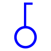      | `4807` | `babsGruppenfuehrer`     | Gruppenführer      | Chef de groupe           | Cappogruppo           |         |        |
| 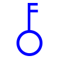 | `4808` | `babsOffizierZugfuehrer` | Offizier-Zugführer | Officier-Chef de section | Uffiziale-Caposezione |         |        |

---

## 5 · Einrichtungen im Einsatzraum

**Einrichtungen im Einsatzraum** / Installations temporaires / Installazioni nel settore d'intervento - nella zona sinistrata

| Icon                                                                                                                                                                                                                                              | ID      | Export                              | DE                             | FR                                     | IT                                       | Pattern | Raster |
| ----------------------------------------------------------------------------------------------------------------------------------------------------------------------------------------------------------------------------------------------------------------------------------------------------- | ------- | ----------------------------------- | ------------------------------ | -------------------------------------- | ---------------------------------------- | ------- | ------ |
|                                                                                                                                                                                                                   | `5101`  | `babsVerkehrsposten`                | Verkehrsposten                 | Poste de circulation                   | Posto di circolazione                    |         | ✓      |
| 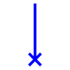                                                                                                                                                                                                  | `5102`  | `babsStandortMobileFuehrungsstelle` | Standort mobile Führungsstelle | Poste de conduite mobile               | Ubicazione posto di condotta mobile      |         | ✓      |
| 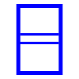                                                                                                                                                                                                                    | `5103`  | `babsSammelstelle`                  | Sammelstelle                   | Poste-collecteur                       | Posto-collettore                         |         |        |
|                                                                                                                                                                                                                 | `5104`  | `babsBetreuungsstelle`              | Betreuungsstelle               | Poste-d-assistance                     | Posto-d-assistenza                       |         |        |
| 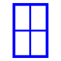                                                                                                                                                                                                           | `5105`  | `babsPatientensammelstelle`         | Patientensammelstelle          | Poste-collecteur-de-patients           | Posto-collettore-dei-pazienti            |         |        |
| 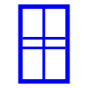                                                                                                                                                                                                            | `5106`  | `babsSanitaetshilfsstelle`          | Sanitaetshilfsstelle           | Poste-medical-avance                   | Posto-di-soccorso-sanitario              |         |        |
| &nbsp;&nbsp; | `5107`  | `babsFahrzeugplatz`                 | Fahrzeugplatz                  | Place pour véhicules                   | Posteggio veicoli                        |         |        |
|                                                                                                                                                                                                                   | `5108`  | `babsBLaboratorium`                 | B Laboratorium                 | Laboratoire B                          | Laboratorio B                            |         | ✓      |
|                                                                                                                                                                                                       | `5109`  | `babsABCDekontaminationsstelle`     | ABC Dekontaminationsstelle     | Poste de décontamination ABC           | Posto di decontaminazione NBC            |         |        |
|                                                                                                                                                                                                                      | `5110`  | `babsHaftstrasse`                   | Haftstrasse                    | Poste ou zone de rétention             | Posto (zone) di ritenzione               |         |        |
|                                                                                                                                                                                                                | `5111`  | `babsTotensammelstelle`             | Totensammelstelle              | Poste-collecteur-de-morts              | Posto-colletore-dei-morti                |         |        |
|                                                                                                                                                                                                         | `5112`  | `babsVerpflegungsabgabestelle`      | Verpflegungsabgabestelle       | Poste-de-distribution                  | Posto-distribuzione-sussistenza          |         |        |
|                                                                                                                                                                                                        | `5113`  | `babsBetriebsstoffabgabestelle`     | Betriebsstoffabgabestelle      | Station-de-carburant                   | Posto-distribuzione-carburante           |         |        |
|                                                                                                                                                                                                               | `5114`  | `babsInformationsstelle`            | Informationsstelle             | poste d'information                    | Posto d’informazione                     |         | ✓      |
|                                                                                                                                                                                                              | `5115`  | `babsInformationszentrum`           | Informationszentrum            | centre de presse                       | Centro informazioni                      |         |        |
|                                                                                                                                                                                                                 | `5116`  | `babsDebriefingstelle`              | Debriefingstelle               | Poste de débriefing                    | Posto di débriefing                      |         |        |
|                                                                                                                                                                                                          | `5117`  | `babsAngehoerigensammelstelle`      | Angehörigensammelstelle        | Poste collecteur pour les proches      | Posto colletore dei famigliari           |         |        |
|                                                                                                                                                                                                              | `5118`  | `babsKadaversammelstelle`           | Kadaversammelstelle            | Poste collecteur de cadavres d'animaux | Posto collettore dei cadaveri di animali |         |        |
|                                                                                                                                                                                                             | `5119`  | `babsStreugutsammelstelle`          | Streugutsammelstelle           | Poste collecteur des objets trouvés    | Posto colletore degli aggretti trovati   |         |        |
|                                                                                                                                                                                                          | `5120`  | `babsTrinkwasserabgabestelle`       | Trinkwasserabgabestelle        | Poste de distribution d'eau potable    | Posto di distribuzione acqua potabile    |         |        |
|                                                                                                                                                                                                                   | `5121`  | `babsKontrollstelle`                | Kontrollstelle                 | Point de contrôle                      | Posto di controllo                       |         | ✓      |
|                                                                                                                                                                                                                  | `5122`  | `babsKontrollzentrum`               | Kontrollzentrum                | Centre de contrôle                     | Centro di controllo                      |         | ✓      |
|                                                                                                                                                                                                                        | `5123`  | `babsUmleitung`                     | Umleitung                      | Deviations                             | Deviazione                               |         |        |
|                                                                                                                                                                                                                           | `5124`  | `babsPforte`                        | Pforte                         | Porte d'accès                          | Porta                                    |         | ✓      |
|                                                                                                                                                                                                          | `5125`  | `babsAbsperrungVerkehrswege`        | Absperrung Verkehrswege        | Fermeture de la route                  | Sbarramento delle vie di comunicazione   |         |        |
|                                                                                                                                                                                                                      | `5126`  | `babsAbsperrungEinsatzraum`         | Einsatzraum                    | Secteur d'engagement                   | Settore d'intervento                     |         | ✓      |
|                                                                                                                                                                                                                           | `5127`  | `babsSperre`                        | Sperre                         | Barrage                                | Sbarramento                              |         |        |
|                                                                                                                                                                                                                       | `5128`  | `babsStuetzpunkt`                   | Stützpunkt                     | Point de sécurité police               | Caposaldo Polizia                        |         | ✓      |
|                                                                                                                                                                                                             | `5129`  | `babsHelikopterlandeplatz`          | Helikopterlandeplatz           | Place d'atterrissage-Helico            | Piazza-d-atterraggio-elicotteri          |         |        |
|                                                                                                                                                                                                                | `5130`  | `babsDrohnenlandeplatz`             | Drohnenlandeplatz              | Place d'atterrissage pour drônes       | Piazza d’atterraggio per drone           |         | ✓      |
|                                                                                                                                                                                                                    | `5131`  | `babsMaterialdepot`                 | Materialdepot                  | Depot-materiel                         | Deposito-del-materiale                   |         |        |
|                                                                                                                                                                                                                     | `5132a` | `babsBeobachtung`                   | Beobachtung                    | Observation                            | Osservazione                             |         |        |
|                                                                                                                                                                                                                      | `5132b` | `babsBeobachten`                    | Beobachten                     | Observer                               | Osservare                                |         |        |
|                                                                                                                                                                                                                     | `5133`  | `babsUeberwachung`                  | Ueberwachung                   | Surveillance                           | Sorveglianza                             |         |        |
|                                                                                                                                                                                                                     | `5134`  | `babsKGSNotlager`                   | KGS Notlager                   | Entrepôt d'urgence PBC                 | Magazzino PBC di fortuna                 |         |        |
|                                                                                                                                                                                                                     | `5135`  | `babsKGSNotdepot`                   | KGS-Notdepot                   | Depot-d-urgence-PBC                    | Deposito PBC di fortuna                  |         |        |
|                                                                                                                                                                                                                  | `5136`  | `babsKGSSammelpunkt`                | KGS Sammelpunkt                | Point de collecte PBC                  | Posto collettore PBC                     |         | ✓      |
|                                                                                                                                                                                                                         | `5137`  | `babsKGSLogo`                       | KGS Logo                       | Logo PBC                               | Logo PBC                                 |         | ✓      |

---

## 6 · Bewegungen

**Bewegungen** / Mouvements / Spostamenti

| Icon                                                                                                                                                                                                                                            | ID      | Export                           | DE                         | FR                      | IT                       | Pattern                                                                                                        | Raster |
| --------------------------------------------------------------------------------------------------------------------------------------------------------------------------------------------------------------------------------------------------------------------------------------------------- | ------- | -------------------------------- | -------------------------- | ----------------------- | ------------------------ | -------------------------------------------------------------------------------------------------------------- | ------ |
|                                                                                                                                                                                                    | `6101a` | `babsBeabsichtigteVerschiebung`  | Beabsichtigte Verschiebung | mouvement prevu         | Spostamento pianificato  |                                                                                                                | ✓      |
|                                                                                                                                                                                                    | `6101b` | `babsDurchgefuehrteVerschiebung` | Durchgeführte Verschiebung | mouvement exécuté       | Spostamento eseguito     |                                                                                                                | ✓      |
|                                                                                                                                                                                                        | `6102a` | `babsBeabsichtigterEinsatz`      | Beabsichtigter Einsatz     | Engagement-prevu        | Intervento pianificato   |                                                                                                                |        |
|                                                                                                                                                                                                        | `6102b` | `babsDurchgefuehrterEinsatz`     | Durchgeführter Einsatz     | Engagement-execute      | Intervento eseguito      |                                                                                                                |        |
|                                                                                                                                                                                                       | `6103a` | `babsBeabsichtigteErkundung`     | Beabsichtigte Erkundung    | Reconnaissance-prevue   | Ricognizione pianificata |  |        |
|                                                                                                                                                                                                       | `6103b` | `babsDurchgefuehrteErkundung`    | Durchgeführte Erkundung    | Reconnaissance-executee | Ricognizione eseguita    |  |        |
|                                                                                                                                                                                                                    | `6104`  | `babsDurchsuchen`                | Durchsuchen                | Fouiller                | Perquisire               |                                                                                                                |        |
|                                                                                                                                                                                                      | `6105`  | `babsMotorisierteVerschiebung`   | Motorisierte Verschiebung  | Déplacement motorisé    | Spostamento motorizzato  |                                                                                                                |        |
| &nbsp;&nbsp; | `6106`  | `babsRettungsachse`              | Rettungsachse              | Axe de sauvetage        | Asse di salvataggio      |           | ✓      |
|                                                                                                                                                                                                                     | `6107`  | `babsUeberwachen`                | Überwachen                 | Surveiller              | Sorvegliare              |                                                                                                                |        |
|                                                                                                                                                                                                                         | `6108`  | `babsBergen`                     | Bergen                     | Secourir                | Soccorrere               |                                                                                                                | ✓      |

---

## 7 · Fahrzeuge

**Fahrzeuge** / Véhicules / Veicoli

| Icon                                                                                                                                                                                                                                         | ID     | Export                       | DE                      | FR                             | IT                                    | Pattern | Raster |
| ------------------------------------------------------------------------------------------------------------------------------------------------------------------------------------------------------------------------------------------------------------------------------------------------ | ------ | ---------------------------- | ----------------------- | ------------------------------ | ------------------------------------- | ------- | ------ |
|                                                                                                                                                                                                                    | `7101` | `babsMotorrad`               | Motorrad                | Motocycle                      | Motociclo                             |         | ✓      |
|                                                                                                                                                                                                                        | `7102` | `babsBoot`                   | Boot                    | Embarcation                    | Imbarcazione                          |         | ✓      |
|                                                                                                                                                                                                               | `7103` | `babsMotorfahrzeug`          | Motorfahrzeug           | Vehicule-leger-voiture         | Veicolo per il trasporto (automobile) |         |        |
|                                                                                                                                                                                                           | `7104` | `babsTransportfahrzeug`      | Transportfahrzeug       | Vehicule-de-transport-bus      | Veicoli per il trasporto (Bus)        |         |        |
|                                                                                                                                                                                                                   | `7105` | `babsLastwagen`              | Lastwagen               | Camion-poids-lourd             | Autocarro                             |         |        |
|                                                                                                                                                                                                                    | `7106` | `babsAnhaenger`              | Anhänger                | Remorque                       | Rimorchi                              |         | ✓      |
|                                                                                                                                                                                                                      | `7107` | `babsKipper`                 | Kipper                  | Camion à pont basculant        | Autocarro con cassone ribaltabile     |         | ✓      |
|                                                                                                                                                                                                          | `7108` | `babsZisternenlastwagen`     | Zisternenlastwagen      | Camion citerne                 | Autocisterna                          |         | ✓      |
|                                                                                                                                                                                                              | `7109` | `babsZisternenwagen`         | Zisternenwagen          | Wagon citerne                  | Cisterna                              |         | ✓      |
|                                                                                                                                                                                                           | `7110` | `babsBaggerAufRaedern`       | Bagger auf Rädern       | Excavatrice                    | Escavatrice ruotata                   |         | ✓      |
|                                                                                                                                                                                                     | `7111` | `babsLadeschaufelAufRaedern` | Ladeschaufel auf Rädern | Pelle chargeuse                | Pala caricatrice ruotata              |         | ✓      |
|                                                                                                                                                                                                                   | `7112` | `babsKranwagen`              | Kranwagen               | Camion grue                    | Autogru                               |         | ✓      |
|                                                                                                                                                                                                                  | `7113` | `babsHelikopter`             | Helikopter              | Helicoptere                    | Elicottero                            |         |        |
|                                                                                                                                                                                                                    | `7114` | `babsAmbulanz`               | Ambulanz                | Ambulance                      | Ambulanza                             |         |        |
|                                                                                                                                                                                                                | `7115` | `babsWasserwerfer`           | Wasserwerfer            | Canon-a-eau                    | Lanciaacqua                           |         |        |
|                                                                                                                                                                                                         | `7116` | `babsHubrettungsfahrzeug`    | Hubrettungsfahrzeug     | Elevateur-a-nacelle            | Elevatore-a-navicella                 |         |        |
|                                                                                                                                                                                                              | `7117` | `babsAutodrehleiter`         | Autodrehleiter          | Echelle pivotante aérienne     | Scala-motorizzata                     |         |        |
| &nbsp;&nbsp; | `7118` | `babsTankloeschfahrzeug`     | Tanklöschfahrzeug       | Fourgon-Tonne-pompe            | Autobotte                             |         |        |
|                                                                                                                                                                                                       | `7119` | `babsLuftaufklaerungLeicht`  | Luftaufklärung leicht   | Reconnaissance aérienne légère | Ricognizione aerea leggera            |         | ✓      |

---

## 8 · Bildhafte Signaturen

**Bildhafte Signaturen** / Pictogrammes / Segni convenzionali per eventi

### 81 · Naturbedingte Lagen

_Naturbedingte Lagen / Evénements naturels / Eventi naturali_

| Icon                                     | ID     | Export                     | DE                    | FR                    | IT                         | Pattern | Raster |
| ------------------------------------------------------------------------------------------- | ------ | -------------------------- | --------------------- | --------------------- | -------------------------- | ------- | ------ |
|                  | `8101` | `babsSturm`                | Sturm                 | Tempete               | Tempesta                   |         | ✓      |
|      | `8102` | `babsStarkniederschlag`    | Starkniederschlag     | Fortes-precipitations | Piogge-intense             |         | ✓      |
|        | `8103` | `babsUeberschwemmung`      | Ueberschwemmung       | Inondation            | Piena                      |         | ✓      |
|              | `8104` | `babsErdrutsch`            | Erdrutsch             | Glissement-de-terrain | Frana                      |         | ✓      |
|                 | `8105` | `babsLawine`               | Lawine                | Avalanche             | Valanga                    |         | ✓      |
|               | `8106` | `babsErdbeben`             | Erdbeben              | Tremblement de terre  | Terremoto                  |         | ✓      |
|                  | `8107` | `babsDuerre`               | Dürre                 | Sécheresse            | Siccità                    |         | ✓      |
|               | `8108` | `babsEpidemie`             | Epidemie              | Epidémie              | Epidemia                   |         | ✓      |
|             | `8109` | `babsTierseuche`           | Tierseuche            | Epizootie             | Epizoozia                  |         | ✓      |
|  | `8110` | `babsWasserstandGestiegen` | Wasserstand gestiegen | Niveau d'eau monte    | Livello dell'acqua sale    |         |        |
|   | `8111` | `babsWasserstandGesunken`  | Wasserstand gesunken  | Niveau d'eau descent  | Livello dell'acqua in calo |         |        |
|      | `8112` | `babsBachAusgetroknet`     | Bach ausgetroknet     | Ruisseau asséché      | Riverse prosciugati        |         | ✓      |
|         | `8113` | `babsSchweinegrippe`       | Schweinegrippe        | Grippe porcine        | Influenza suina            |         | ✓      |

### 82 · Technisch bedingte Lagen

_Technisch bedingte Lagen / Evénements techniques / Eventi tecnici_

| Icon                                               | ID     | Export                               | DE                              | FR                                         | IT                                          | Pattern | Raster |
| ----------------------------------------------------------------------------------------------------- | ------ | ------------------------------------ | ------------------------------- | ------------------------------------------ | ------------------------------------------- | ------- | ------ |
|                            | `8201` | `babsBrand`                          | Brand                           | Incendie                                   | Incendio                                    |         | ✓      |
|                        | `8202` | `babsExplosion`                      | Explosion                       | Explosion                                  | Esplosione                                  |         | ✓      |
|                             | `8203` | `babsStau`                           | Stau                            | Embouteillage                              | Colonna                                     |         | ✓      |
|                       | `8204` | `babsAutounfall`                     | Autounfall                      | Accident-auto                              | Incidente-della-circolazione                |         | ✓      |
|                | `8205` | `babsEisenbahnunglueck`              | Eisenbahnunglueck               | Accident-ferroviaire                       | Incidente-ferroviario                       |         | ✓      |
|               | `8206` | `babsBachAusgetrocknet`              | Bach ausgetrocknet              | Catastrophe aérienne                       | Catastrofe aerea                            |         | ✓      |
|                   | `8207` | `babsEnergieausfall`                 | Energieausfall                  | Panne énergétique                          | Interruzione dell'energia elettrica         |         | ✓      |
|            | `8208` | `babsKommunikationsstoerung`         | Kommunikationsstörung           | Perturbation de la communication           | Disturbo della comunicazione                |         | ✓      |
|         | `8209` | `babsAusfallWasserversorgung`        | Ausfall Wasserversorgung        | Interruption de l'approvisionnement en eau | Interruzione dell'approvvigionamento idrico |         | ✓      |
|             | `8210` | `babsKanalisationsausfall`           | Kanalisationsausfall            | Egouts-defectueux                          | Interruzione-della-canalizzazione           |         | ✓      |
|                       | `8211` | `babsAtomunfall`                     | Atomunfall                      | Accident-nucleaire                         | Incidente-nucleare                          |         | ✓      |
|                        | `8212` | `babsBiounfall`                      | Biounfall                       | Accident-biologique                        | Incidente-biologico                         |         | ✓      |
|                     | `8213` | `babsChemieunfall`                   | Chemieunfall                    | Accident-chimique                          | Incidente-chimico                           |         | ✓      |
|                 | `8214` | `babsOelverschmutzung`               | Oelverschmutzung                | Pollution-aux-hydrocarbures                | Inquinamento-da-idrocarburi                 |         | ✓      |
|             | `8215` | `babsInfrastrukturschaden`           | Infrastrukturschaden            | Dommages-aux-infrastructures               | Danni-alle-infrastrutture                   |         | ✓      |
|                | `8216` | `babsSchiffsversenkung`              | Schiffsversenkung               | Accident-navigation                        | Incidente-nautico                           |         | ✓      |
|              | `8217` | `babsBrunnenEingestellt`             | Brunnen eingestellt             | Fontaine fermée                            | Fontana chiusa                              |         | ✓      |
|  | `8218` | `babsUnterbruchOeffentlicherVerkehr` | Unterbruch öffentlicher Verkehr | Interruption des transports publics        | Interruzione dei trasporti pubblici         |         | ✓      |
|                 | `8219` | `babsGebaeudeeinsturz`               | Gebaeudeeinsturz                | Immeuble-effondré                          | Crollo-di-edificio                          |         | ✓      |
|                  | `8220` | `babsFischenVerlegt`                 | Fischen verlegt                 | Poissons déplacés                          | Pesci trasferiti                            |         | ✓      |
|                | `8221` | `babsAmphibienVerlegt`               | Amphibien verlegt               | Amphibiens déplacés                        | Anfibi trasferiti                           |         | ✓      |
|            | `8222` | `babsGewaesserverschmutzung`         | Gewässerverschmutzung           | Pollution des eaux                         | Inquinamento delle acque                    |         | ✓      |

### 83 · Gesellschaftlich bedingte Lagen

_Gesellschaftlich bedingte Lagen / Evénements sociaux / Eventi sociali_

| Icon                                                                                                                                                                                                        | ID     | Export                           | DE                           | FR                            | IT                                | Pattern | Raster |
| --------------------------------------------------------------------------------------------------------------------------------------------------------------------------------------------------------------------------------------------------------------- | ------ | -------------------------------- | ---------------------------- | ----------------------------- | --------------------------------- | ------- | ------ |
|                                                                                                                                                                                | `8301` | `babsPluenderung`                | Pluenderung                  | Pillage                       | Saccheggi                         |         | ✓      |
| &nbsp;&nbsp; | `8302` | `babsDieb`                       | Dieb                         | Vol                           | Furto                             |         |        |
|                                                                                                                                                                              | `8303` | `babsRaubDrohung`                | Raub, Drohung                | Vol, menaces                  | Rapina, minaccia                  |         | ✓      |
|                                                                                                                                                               | `8304` | `babsZwischenfallMitExtremisten` | Zwischenfall mit Extremisten | Incident avec des extrémistes | Incidente con estremisti          |         | ✓      |
|                                                                                                                                                                             | `8305` | `babsDemoGewaltlos`              | Demo-gewaltlos               | Manifestation                 | Dimostrazioni                     |         | ✓      |
|                                                                                                                                                                             | `8306` | `babsDemoGewaltsam`              | Demo-gewaltsam               | Manifestation-avec-exactions  | Dimostrazioni-con-disordini       |         | ✓      |
|                                                                                                                                                                                  | `8307` | `babsHooligans`                  | Hooligans                    | Hooligans                     | Hooligans                         |         | ✓      |
|                                                                                                                                                                                 | `8308` | `babsSchlaegerei`                | Schlägerei                   | Bagarre                       | Rissa                             |         | ✓      |
|                                                                                                                                                                           | `8309` | `babsSachbeschaedigung`          | Sachbeschädigung             | Dégradation de biens          | Danno alla proprietà              |         | ✓      |
|                                                                                                                                                                     | `8310` | `babsSprayereiFarbanschlag`      | Sprayerei Farbanschlag       | Graffiti                      | Graffito                          |         | ✓      |
|                                                                                                                                                                                | `8311` | `babsTrunkenheit`                | Trunkenheit                  | Ivresse                       | Ubriachezza                       |         | ✓      |
|                                                                                                                                                                                   | `8312` | `babsFahrende`                   | Fahrende                     | Gens du voyage                | Nomadi                            |         | ✓      |
|                                                                                                                                                                              | `8313` | `babsHausbesetzung`              | Hausbesetzung                | Occupation illégale           | Occupazione abusiva               |         | ✓      |
|                                                                                                                                                                             | `8314` | `babsPublicViewing`              | Public Viewing               | Visionnage public             | Visione pubblica                  |         | ✓      |
|                                                                                                                                                                         | `8315` | `babsSportveranstaltung`         | Sportveranstaltung           | Evénement sportif             | Evento sportivo                   |         | ✓      |
|                                                                                                                                                                                 | `8316` | `babsBarrikaden`                 | Barrikaden                   | Barricades                    | Barricate                         |         | ✓      |
|                                                                                                                                                                                | `8317` | `babsGeiselnahme`                | Geiselnahme                  | Prise d'otages                | Sequestro di persona              |         | ✓      |
|                                                                                                                                                                                 | `8318` | `babsEntfuehrung`                | Entführung                   | Chantage                      | Ricatto                           |         | ✓      |
|                                                                                                                                                                         | `8319` | `babsFlugzeugentfuehrung`        | Flugzeugentführung           | Détournement d'avion          | Dirottamento aereo                |         | ✓      |
|                                                                                                                                                                                  | `8320` | `babsEntfuerung`                 | Entfürung                    | Enlèvement                    | Rapimento                         |         | ✓      |
|                                                                                                                                                                                | `8321` | `babsSchiesserei`                | Schiesserei                  | Fusillade                     | Sparatoria                        |         | ✓      |
|                                                                                                                                                                                       | `8322` | `babsAMOK`                       | AMOK                         | AMOK                          | AMOK                              |         |        |
|                                                                                                                                                                             | `8323` | `babsTerroranschlag`             | Terroranschlag               | Attentat terroriste           | Attentato terroristico            |         | ✓      |
|                                                                                                                                                                              | `8324` | `babsBombendrohung`              | Bombendrohung                | Menace d'attentat à la bombe  | Minaccia di attentato dinamitardo |         | ✓      |
|                                                                                                                                                                           | `8325` | `babsBombenanschlag`             | Bombenanschlag--             | Attentat-a-la-bombe           | Attentato-dinamitardo             |         | ✓      |
|                                                                                                                                                                                | `8326` | `babsMassenpanik`                | Massenpanik                  | Effet-de-panique              | Panico-di-massa                   |         | ✓      |
|                                                                                                                                                                              | `8327` | `babsBrandanschlag`              | Brandanschlag                | Incendie-criminel             | Attentato-incendiario             |         | ✓      |
|                                                                                                                                                                                   | `8328` | `babsSabotage`                   | Sabotage                     | Sabotage                      | Sabotaggio                        |         | ✓      |
|                                                                                                                                                                                     | `8329` | `babsBomben`                     | Bomben                       | Bombes                        | Bombe                             |         | ✓      |
|                                                                                                                                                                      | `8330` | `babsBedrohungDurchMinen`        | Bedrohung durch Minen        | Menace de mines               | Minaccia delle mine               |         | ✓      |
|                                                                                                                                                                                    | `8331` | `babsDrohung`                    | Drohung                      | Menaces                       | Minaccia                          |         | ✓      |
|                                                                                                                                                                                | `8332` | `babsFluechtlinge`               | Flüchtlinge                  | Réfugiés                      | Rifugiati                         |         | ✓      |
|                                                                                                                                                                            | `8333` | `babsFlugzeugabsturz`            | Flugzeugabsturz              | accident d'avion              | Incidente aereo                   |         | ✓      |

---

## 9 · Spezial

**Spezial** / Spéciaux / Speciali

| Icon                                                         | ID      | Export                                    | DE                                       | FR                                     | IT                                 | Pattern | Raster |
| --------------------------------------------------------------------------------------------------------------- | ------- | ----------------------------------------- | ---------------------------------------- | -------------------------------------- | ---------------------------------- | ------- | ------ |
|                            | `9101a` | `babsAutobahnOffen`                       | Autobahn offen                           | Autoroute ouverte                      | Autostrada aperta                  |         |        |
|                         | `9101b` | `babsAutobahnGesperrt`                    | Autobahn gesperrt                        | Autoroute fermée                       | Autostrada chiusa                  |         |        |
|   | `9101c` | `babsAutobahnEinspurigGesperrtLinkeSpur`  | Autobahn, einspurig gesperrt linke Spur  | Autoroute, une voie fermée côté gauche | Autostrada, corsia sinistra chiusa |         |        |
|  | `9101d` | `babsAutobahnEinspurigGesperrtRechteSpur` | Autobahn, einspurig gesperrt rechte Spur | Autoroute, une voie fermée côté droit  | Autostrada, corsia destra chiusa   |         |        |
|                         | `9102`  | `babsSchifffahrtVerbot`                   | Schifffahrt-verbot                       | Interdiction-de-naviguer               | Divieto-di-navigazione             |         | ✓      |
|                            | `9103`  | `babsUeberflugverbot`                     | Ueberflugverbot                          | Interdiction-de-survoler               | Divieto-di-sorvolo                 |         | ✓      |
|                          | `9104`  | `babsNotfalltreffpunkt`                   | Notfalltreffpunkt                        | Point-de-rassemblement-d-urgence       | Punto-di-raccolta-d-urgenza        |         |        |

---
