# BABS Icon Reference

257 civil-protection icons across 9 categories.
Labels in German (DE), French (FR) and Italian (IT).
For divergent icons (different graphic per language) all three variants are shown side by side.

---

## Contents

- [1 · Auswirkungen](#1--auswirkungen)
- [2 · Gefahren](#2--gefahren)
- [3 · Zivile Führungsstandorte](#3--zivile-f-hrungsstandorte)
- [4 · Formationen](#4--formationen)
- [5 · Einrichtungen im Einsatzraum](#5--einrichtungen-im-einsatzraum)
- [6 · Bewegungen](#6--bewegungen)
- [7 · Fahrzeuge](#7--fahrzeuge)
- [8 · Bildhafte Signaturen](#8--bildhafte-signaturen)
- [9 · Spezial](#9--spezial)

---

## 1 · Auswirkungen

**Auswirkungen** / Effets / Effetti

### 11 · Auswirkungen von Schadenereignissen auf Gebiete

*Auswirkungen von Schadenereignissen auf Gebiete / Effets d'événements dommageables sur le terrain et les objectifs / Effetti provocati da sinistri sul territorio e sugli obiettivi*

| Icon | ID | DE | FR | IT |
|---|---|---|---|---|
|  | `1101` | Beschaedigung | Degat | Danneggiamento |
|  | `1102` | Teilzerstoerung | Destruction-partielle | Distruzione-parziale |
|  | `1103` | Totalzerstoerung | Destruction-totale | Distruzione-totale |
|  | `1104` | Brand-einzelnes-Gebaeude-Flamme | Incendie-isole | Incendio-di-un-singolo-edificio |
|  | `1105a` | Explosionsherd | Foyer-d-explosion | Focolaio-esplosione |
|  | `1105b` | Explosionherd-Beispiel | Foyer-d-explosion-exemple | Focolaio-esplosione-esempio |
| 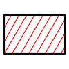 | `1106a` | Brand einzelnes Gebäude - Signatur | Incendie d'un bâtiment isolé | Incendio di un singolo edificio |
| 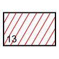 | `1106b` | Brand einzelnes Gebäude - Beispiel | Incendie d'un bâtiment isolé-exemple | Incendio di un singolo edificio-esempio |
|  | `1107a` | Brand mehrerer Gebäude - Signatur | Incendie de plusieurs bâtiments | Incendio di diversi edifici vicini |
|  | `1107b` | Brand mehrerer Gebäude - Beispiel | Incendie de plusieurs bâtiments-exemple | Incendio di diversi edifici vicini-esempio |
| 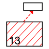 | `1108` | Brandübergriffsgefahr - Beispiel | Danger d'extension du feu-exemple | Direzione della propagazione dell'incendio-esempio |
|  | `1109` | Brandübergriff erfolgt - Beispiel | Extension du feu-exemple | Propagazione avvenuta-esempio |
|  | `1110` | Brandzone Flächenbrand | Zone en feu | Zona toccata dall’incendio |
|  | `1111a` | Brandübergriffsgefahr - Signatur | Danger d'extension du feu | Pericolo di propagazione dell'incendio |
| 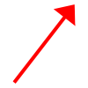 | `1111b` | Brandübergriff erfolgt - Signatur | Extension du feu | Propagazione avvenuta |
| 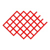 | `1112` | Zerstörte Zone einer Ortschaft | Zone sinistrée impraticable | Zona sinistrata impraticabile |
| 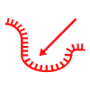 | `1113` | Rutschgebiet | Glissement de terrain avec direction | Zona colpita da frana con indicazione della direzione |
|  | `1114` | Schadengebiet - Schadenraum | Zone de dégâts | Zona sinistrata |
|  | `1115` | Überschwemmtes Gebiet | Zone inondée avec direction du flux | Zona inondata con indicazione della direzione |
| 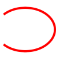 | `1116a` | Trümmerbereich - Signatur | Zone de décombre | Zona macerie |
|  | `1116b` | Trümmerbereich - Beispiel | Zone de décombre-exemple | Zona macerie-esempio |

### 12 · Auswirkungen von Schadenereignissen auf Verkehrswege

*Auswirkungen von Schadenereignissen auf Verkehrswege / Effets d'événements dommageables sur les voies de communication / Effetti provocati da sinistri sulle vie di comunicazione*

| Icon | ID | DE | FR | IT |
|---|---|---|---|---|
|  | `1201` | Str erschwert befahrbar - begehbar | Route difficilement praticable | Strada percorribile |
| 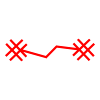 | `1202` | Str nicht befahrbar - schwer begehbar | Route impraticable pour les vhc | Strada non percorribile per i veicoli |
|  | `1203` | Str unpassierbar - gesperrt | Route impraticable-barrée | Strada impraticabile-sbarrata |

### 13 · Auswirkungen von Schadenereignissen auf Personen

*Auswirkungen von Schadenereignissen auf Personen / Effets d'événements dommageables sur les personnes / Effetti provocati da sinistri sulle persone*

| Icon | ID | DE | FR | IT |
|---|---|---|---|---|
|  | `1301` | Verletzte | Blesses | Feriti |
|  | `1302` | Vermisste | Disparus | Dispersi |
| 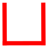 | `1303` | Obdachlose | Sans-abri | Senzatetto |
| 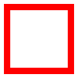 | `1304` | Eingesperrte | Enfermes | Persone-imprigionate |
|  | `1305` | Tote | Morts | Morti |

### 14 · Auswirkungen von Schadenereignissen auf Gebiete Gelb

*Auswirkungen von Schadenereignissen auf Gebiete Gelb / Effets d'événements dommageables sur le terrain / Effetti provocati da sinistri sul territorio*

| Icon | ID | DE | FR | IT |
|---|---|---|---|---|
| 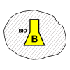 | `1401` | Biologisch verseuchtes Gebiet | Zone biologiquement contaminée | Zona infettata |
|  | `1402` | Chemievergiftete Zone flüssig - sesshaft | Zone chimiquement contaminée sous forme liquide | Zona intossicata liquido-persistente |
|  | `1403` | Chemievergiftetes Gebiet gasförmig - flüchtig | Zone chimiquement contaminée sous forme gazeuse | Zona intossicata gas-volatile |
|  | `1404` | Radioaktives Gebiet | Zone radioactive | Zona contaminata radioattività |

---

## 2 · Gefahren

**Gefahren** / Dangers / Pericoli

| Icon | ID | DE | FR | IT |
|---|---|---|---|---|
| 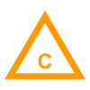 | `2101` | Chemikalien Gefahr | Danger chimique | Pericolo sostanze chimiche |
| 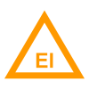 | `2102` | Elektrizität Gefahr | Danger électrique | Pericolo ellettricità |
| 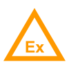 | `2103` | Explosion Gefahr | Danger d'explosion | Pericolo esplosione |
| 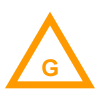 | `2104` | Gas Gefahr | Danger de gaz | Pericolo gas |
|  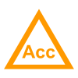  | `2105` | Unfall Gefahr | Danger d'accident | Pericolo Incidente |
| 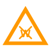 | `2106` | Gefahr durch Löschen mit Wasser | Danger-si-extinction-avec-eau | Pericolo in caso di spegnimento con acqua |
| 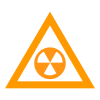 | `2107` | Radioaktive Stoffe Gefahr | Danger substances-radioactives | Pericolo sostanze radioattive |
|  | `2108` | Gefahr für Grundwasser | Danger-pour-les-eaux de surface | Pericolo per le acque in superficie |
|  | `2109a` | Gefahrentafel ohne UN-Nummer | Plaque de danger sans numéro ONU | Pannello di pericolo senza numero ONU |
| 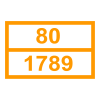 | `2109b` | Gefahrentafel mit UN-Nummer | Plaque de danger avec numéro ONU | Pannello di pericolo con numero ONU |

---

## 3 · Zivile Führungsstandorte

**Zivile Führungsstandorte** / Emplacements de conduite civils / Ubicazioni di condotta civili

| Icon | ID | DE | FR | IT |
|---|---|---|---|---|
| 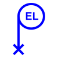 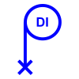  | `3101` | Einsatzleitung | Direction d'intervention | Direzione d'intervento |
| 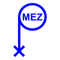 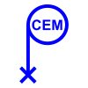  | `3102` | Mobile Einsatzzentrale | Centrale d'engagement mobile | Centrale d'intervento mobile |
| 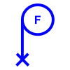 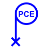  | `3103` | Kommandoposten Front | PC engagement | Posto di comando fronte |
|    | `3104` | Kommandoposten Rückwärtiges | PC opérations | Posto di comando retrovie |
|  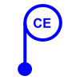  | `3105` | Einsatzzentrale | Centrale d'engagement | Centrale d'intervento |
| 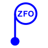   | `3106` | Ziviles Führungsorgan | Organe de conduite civile | Organo di condotta civile |
|  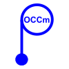 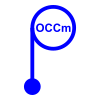 | `3107` | Gemeindeführungsorgan | Organe de conduite communal | Organo di condotta comunale |
|  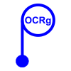 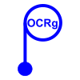 | `3108` | Regionales Führungsorgan | Organe de conduite régional | Organo di condotta regionale |
|  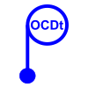  | `3109` | Bezirksführungsorgan | Organe de conduite de district | Organo di condotta distrettuale |
|  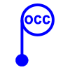  | `3110` | Kantonales Führungsorgan | Organe de conduite cantonal | Organo di condotta cantonale |

---

## 4 · Formationen

**Formationen** / Formations / Formazione

### 41 · Polizei

*Polizei / Police / Polizia*

| Icon | ID | DE | FR | IT |
|---|---|---|---|---|
|  | `4101` | Trupp-P | Equipe-P | Squadra-P |
|  | `4102` | Gruppe-P | Groupe-P | Gruppo-P |
|  | `4103` | Zug-P | Section-P | Sezione-P |
|  | `4104` | Kompanie-P | Companie-P | Compania-P |
|  | `4105` | Bataillon-P | Bataillon-P | Bataillone-P |
| 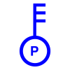 | `4106` | Einsatzleiter-P | DI-P | Capointervento-P |
|  | `4107` | Gruppenführer-P | Chef de groupe-P | Cappogruppo-P |
| 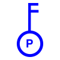 | `4108` | Offizier-Zugführer-P | Officier-Chef de section-P | Uffiziale-Caposezione-P |

### 42 · Feuerwehr

*Feuerwehr / Pompier / Pompieri*

| Icon | ID | DE | FR | IT |
|---|---|---|---|---|
|    | `4201` | Trupp-FW | Equipe-SP | Squadra-CP |
|    | `4202` | Gruppe-FW | Groupe-SP | Gruppo-CP |
|    | `4203` | Zug-FW | Section-SP | Sezione-CP |
|    | `4204` | Kompanie-FW | Companie-SP | Compania-CP |
|    | `4205` | Bataillon-FW | Bataillon-SP | Bataillone-CP |
| 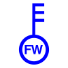 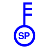  | `4206` | Einsatzleiter-FW | DI-SP | Capointervento-CP |
|    | `4207` | Gruppenführer-FW | Chef de groupe-SP | Cappogruppo-CP |
| 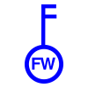   | `4208` | Offizier-Zugführer-FW | Officier-Chef de section-SP | Uffiziale-Caposezione-CP |

### 43 · Sanitätsdienst

*Sanitätsdienst / Santé publique / Sanità pubblica*

| Icon | ID | DE | FR | IT |
|---|---|---|---|---|
|  | `4301` | Trupp-San | Equipe-San | Squadra-San |
|  | `4302` | Gruppe-San | Groupe-San | Gruppo-San |
|  | `4303` | Zug-San | Section-San | Sezione-San |
|  | `4304` | Kompanie-San | Companie-San | Compania-San |
|  | `4305` | Bataillon-San | Bataillon-San | Bataillone-San |
| 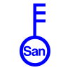 | `4306` | Einsatzleiter-San | DI-San | Capointervento-San |
|  | `4307` | Gruppenführer-San | Chef de groupe-San | Cappogruppo-San |
|  | `4308` | Offizier-Zugführer-San | Officier-Chef de section-San | Uffiziale-Caposezione-San |

### 44 · Zivilschutz

*Zivilschutz / PCi / PCi*

| Icon | ID | DE | FR | IT |
|---|---|---|---|---|
|    | `4401` | Trupp-ZS | Equipe-PCi | Squadra-PCi |
|    | `4402` | Gruppe-ZS | Groupe-PCi | Gruppo-PCi |
|    | `4403` | Zug-ZS | Section-PCi | Sezione-PCi |
|    | `4404` | Kompanie-ZS | Companie-PCi | Compania-PCi |
|    | `4405` | Bataillon-ZS | Bataillon-PCi | Bataillone-PCi |
| 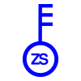 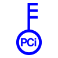  | `4406` | Einsatzleiter-ZS | DI-PCi | Capointervento-PCi |
| 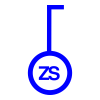   | `4407` | Gruppenführer-ZS | Chef de groupe-PCi | Cappogruppo-PCi |
| 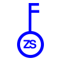   | `4408` | Offizier-Zugführer-ZS | Officier-Chef de section-PCi | Uffiziale-Caposezione-PCi |

### 45 · Techn B

*Techn B / Services techn / Servizi tecnici*

| Icon | ID | DE | FR | IT |
|---|---|---|---|---|
|    | `4501` | Trupp-TechnB | Equipe-S tec | Squadra-S tec |
|    | `4502` | Gruppe-TechnB | Groupe-S tec | Gruppo-S tec |
|    | `4503` | Zug-Techn | Section-S tec | Sezione-S tec |
|    | `4504` | Kompanie-TechnB | Companie-S tec | Compania-S tec |
|    | `4505` | Bataillon-TechnB | Bataillon-S tec | Bataillone-S tec |
|  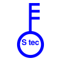  | `4506` | Einsatzleiter-TechB | DI-S tec | Capointervento-S tec |
|    | `4507` | Gruppenführer-TechnB | Chef de groupe-S tec | Cappogruppo-S tec |
|  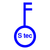  | `4508` | Offizier-Zugführer-TechnB | Officier-Chef de section-S tec | Uffiziale-Caposezione-S tec |

### 46 · Armee

*Armee / Armée / Esercito*

| Icon | ID | DE | FR | IT |
|---|---|---|---|---|
|    | `4601` | Trupp-A | Equipe-A | Squadra-Es |
|    | `4602` | Gruppe-A | Groupe-A | Gruppo-Es |
|    | `4603` | Zug-A | Section-A | Sezione-Es |
|    | `4604` | Kompanie-A | Companie-A | Compania-Es |
|   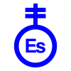 | `4605` | Bataillon-A | Bataillon-A | Bataillone-Es |
| 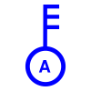  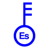 | `4606` | Einsatzleiter-A | DI-A | Capointervento-Es |
| 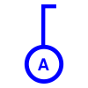  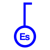 | `4607` | Gruppenführer-A | Chef de groupe-A | Cappogruppo-Es |
|    | `4608` | Offizier - Zugführer-A | Officier-Chef de section-A | Uffiziale-Caposezione-Es |

### 47 · Partner ohne Hierarchiestufe

*Partner ohne Hierarchiestufe / Partenaires sans hiérarchie / Partner non gerarchiche*

| Icon | ID | DE | FR | IT |
|---|---|---|---|---|
|  | `4701` | P | P | P |
|    | `4702` | FW | SP | CP |
|  | `4703` | San | San | San |
|    | `4704` | ZS | PCi | PCi |
|    | `4705` | TechnB | S tec | S tec |
|    | `4706` | A | A | Es |

### 48 · Hierarchiestufe ohne Partner

*Hierarchiestufe ohne Partner / Hiérarchies sans partenaire / Gerarchie senza partner*

| Icon | ID | DE | FR | IT |
|---|---|---|---|---|
|  | `4801` | Trupp | Equipe | Squadra |
|  | `4802` | Gruppe | Groupe | Gruppo |
|  | `4803` | Zug | Section | Sezione |
|  | `4804` | Kompanie | Companie | Compania |
|  | `4805` | Bataillon | Bataillon | Bataillone |
|  | `4806` | Einsatzleiter | DI | Capointervento |
|  | `4807` | Gruppenführer | Chef de groupe | Cappogruppo |
|  | `4808` | Offizier-Zugführer | Officier-Chef de section | Uffiziale-Caposezione |

---

## 5 · Einrichtungen im Einsatzraum

**Einrichtungen im Einsatzraum** / Installations temporaires / Installazioni nel settore d'intervento - nella zona sinistrata

| Icon | ID | DE | FR | IT |
|---|---|---|---|---|
|  | `5101` | Verkehrsposten | Poste de circulation | Posto di circolazione |
|  | `5102` | Standort mobile Führungsstelle | Poste de conduite mobile | Ubicazione posto di condotta mobile |
|  | `5103` | Sammelstelle | Poste-collecteur | Posto-collettore |
|  | `5104` | Betreuungsstelle | Poste-d-assistance | Posto-d-assistenza |
|  | `5105` | Patientensammelstelle | Poste-collecteur-de-patients | Posto-collettore-dei-pazienti |
|  | `5106` | Sanitaetshilfsstelle | Poste-medical-avance | Posto-di-soccorso-sanitario |
|    | `5107` | Fahrzeugplatz | Place pour véhicules | Posteggio veicoli |
|  | `5108` | B Laboratorium | Laboratoire B | Laboratorio B |
|  | `5109` | ABC Dekontaminationsstelle | Poste de décontamination ABC | Posto di decontaminazione NBC |
|  | `5110` | Haftstrasse | Poste ou zone de rétention | Posto (zone) di ritenzione |
|  | `5111` | Totensammelstelle | Poste-collecteur-de-morts | Posto-colletore-dei-morti |
|  | `5112` | Verpflegungsabgabestelle | Poste-de-distribution | Posto-distribuzione-sussistenza |
|  | `5113` | Betriebsstoffabgabestelle | Station-de-carburant | Posto-distribuzione-carburante |
|  | `5114` | Informationsstelle | poste d'information | Posto d’informazione |
|  | `5115` | Informationszentrum | centre de presse | Centro informazioni |
|  | `5116` | Debriefingstelle | Poste de débriefing | Posto di débriefing |
|  | `5117` | Angehörigensammelstelle | Poste collecteur pour les proches | Posto colletore dei famigliari |
|  | `5118` | Kadaversammelstelle | Poste collecteur de cadavres d'animaux | Posto collettore dei cadaveri di animali |
|  | `5119` | Streugutsammelstelle | Poste collecteur des objets trouvés | Posto colletore degli aggretti trovati |
|  | `5120` | Trinkwasserabgabestelle | Poste de distribution d'eau potable | Posto di distribuzione acqua potabile |
|  | `5121` | Kontrollstelle | Point de contrôle | Posto di controllo |
|  | `5122` | Kontrollzentrum | Centre de contrôle | Centro di controllo |
|  | `5123` | Umleitung | Deviations | Deviazione |
|  | `5124` | Pforte | Porte d'accès | Porta |
|  | `5125` | Absperrung Verkehrswege | Fermeture de la route | Sbarramento delle vie di comunicazione |
|  | `5126` | Absperrung Einsatzraum | Barrage du secteur d'engagement-exemple | Sbarramento del settore d'intervento-esempio |
|  | `5127` | Sperre | Barrage | Sbarramento |
|  | `5128` | Stützpunkt | Point de sécurité police | Caposaldo Polizia |
|  | `5129` | Helikopterlandeplatz | Place d'atterrissage-Helico | Piazza-d-atterraggio-elicotteri |
|  | `5130` | Drohnenlandeplatz | Place d'atterrissage pour drônes | Piazza d’atterraggio per drone |
|  | `5131` | Materialdepot | Depot-materiel | Deposito-del-materiale |
|  | `5132a` | Beobachtung | Observation | Osservazione |
|  | `5132b` | Beobachten | Observer | Osservare |
|  | `5133` | Ueberwachung | Surveillance | Sorveglianza |
|  | `5134` | KGS Notlager | Entrepôt d'urgence PBC | Magazzino PBC di fortuna |
|  | `5135` | KGS-Notdepot | Depot-d-urgence-PBC | Deposito PBC di fortuna |
|  | `5136` | KGS Sammelpunkt | Point de collecte PBC | Posto collettore PBC |
|  | `5137` | KGS Logo | Logo PBC | Logo PBC |

---

## 6 · Bewegungen

**Bewegungen** / Mouvements / Spostamenti

| Icon | ID | DE | FR | IT |
|---|---|---|---|---|
|  | `6101a` | Beabsichtigte Verschiebung | mouvement prevu | Spostamento pianificato |
|  | `6101b` | Durchgeführte Verschiebung | mouvement exécuté | Spostamento eseguito |
|  | `6102a` | Beabsichtigter Einsatz | Engagement-prevu | Intervento pianificato |
|  | `6102b` | Durchgeführter Einsatz | Engagement-execute | Intervento eseguito |
|  | `6103a` | Beabsichtigte Erkundung | Reconnaissance-prevue | Ricognizione pianificata |
|  | `6103b` | Durchgeführte Erkundung | Reconnaissance-executee | Ricognizione eseguita |
|  | `6104` | Durchsuchen | Fouiller | Perquisire |
|  | `6105` | Motorisierte Verschiebung | Déplacement motorisé | Spostamento motorizzato |
|    | `6106` | Rettungsachse | Axe de sauvetage | Asse di salvataggio |
|  | `6107` | Überwachen | Surveiller | Sorvegliare |
|  | `6108` | Bergen | Secourir | Soccorrere |

---

## 7 · Fahrzeuge

**Fahrzeuge** / Véhicules / Veicoli

| Icon | ID | DE | FR | IT |
|---|---|---|---|---|
|  | `7101` | Motorrad | Motocycle | Motociclo |
|  | `7102` | Boot | Embarcation | Imbarcazione |
|  | `7103` | Motorfahrzeug | Vehicule-leger-voiture | Veicolo per il trasporto (automobile) |
|  | `7104` | Transportfahrzeug | Vehicule-de-transport-bus | Veicoli per il trasporto (Bus) |
|  | `7105` | Lastwagen | Camion-poids-lourd | Autocarro |
|  | `7106` | Anhänger | Remorque | Rimorchi |
|  | `7107` | Kipper | Camion à pont basculant | Autocarro con cassone ribaltabile |
|  | `7108` | Zisternenlastwagen | Camion citerne | Autocisterna |
|  | `7109` | Zisternenwagen | Wagon citerne | Cisterna |
|  | `7110` | Bagger auf Rädern | Excavatrice | Escavatrice ruotata |
|  | `7111` | Ladeschaufel auf Rädern | Pelle chargeuse | Pala caricatrice ruotata |
|  | `7112` | Kranwagen | Camion grue | Autogru |
|  | `7113` | Helikopter | Helicoptere | Elicottero |
|  | `7114` | Ambulanz | Ambulance | Ambulanza |
|  | `7115` | Wasserwerfer | Canon-a-eau | Lanciaacqua |
|  | `7116` | Hubrettungsfahrzeug | Elevateur-a-nacelle | Elevatore-a-navicella |
|  | `7117` | Autodrehleiter | Echelle pivotante aérienne | Scala-motorizzata |
|    | `7118` | Tanklöschfahrzeug | Fourgon-Tonne-pompe | Autobotte |
|  | `7119` | Luftaufklärung leicht | Reconnaissance aérienne légère | Ricognizione aerea leggera |

---

## 8 · Bildhafte Signaturen

**Bildhafte Signaturen** / Pictogrammes / Segni convenzionali per eventi

### 81 · Naturbedingte Lagen

*Naturbedingte Lagen / Evénements naturels / Eventi naturali*

| Icon | ID | DE | FR | IT |
|---|---|---|---|---|
|  | `8101` | Sturm | Tempete | Tempesta |
|  | `8102` | Starkniederschlag | Fortes-precipitations | Piogge-intense |
|  | `8103` | Ueberschwemmung | Inondation | Piena |
|  | `8104` | Erdrutsch | Glissement-de-terrain | Frana |
|  | `8105` | Lawine | Avalanche | Valanga |
|  | `8106` | Erdbeben | Tremblement de terre | Terremoto |
|  | `8107` | Dürre | Sécheresse | Siccità |
|  | `8108` | Epidemie | Epidémie | Epidemia |
|  | `8109` | Tierseuche | Epizootie | Epizoozia |
|  | `8110` | Wasserstand gestiegen | Niveau d'eau monte | Livello dell'acqua sale |
|  | `8111` | Wasserstand gesunken | Niveau d'eau descent | Livello dell'acqua in calo |
|  | `8112` | Bach ausgetroknet | Ruisseau asséché | Riverse prosciugati |
|  | `8113` | Schweinegrippe | Grippe porcine | Influenza suina |

### 82 · Technisch bedingte Lagen

*Technisch bedingte Lagen / Evénements techniques / Eventi tecnici*

| Icon | ID | DE | FR | IT |
|---|---|---|---|---|
|  | `8201` | Brand | Incendie | Incendio |
|  | `8202` | Explosion | Explosion | Esplosione |
|  | `8203` | Stau | Embouteillage | Colonna |
|  | `8204` | Autounfall | Accident-auto | Incidente-della-circolazione |
|  | `8205` | Eisenbahnunglueck | Accident-ferroviaire | Incidente-ferroviario |
|  | `8206` | Bach ausgetrocknet | Catastrophe aérienne | Catastrofe aerea |
|  | `8207` | Energieausfall | Panne énergétique | Interruzione dell'energia elettrica |
|  | `8208` | Kommunikationsstörung | Perturbation de la communication | Disturbo della comunicazione |
|  | `8209` | Ausfall Wasserversorgung | Interruption de l'approvisionnement en eau | Interruzione dell'approvvigionamento idrico |
|  | `8210` | Kanalisationsausfall | Egouts-defectueux | Interruzione-della-canalizzazione |
|  | `8211` | Atomunfall | Accident-nucleaire | Incidente-nucleare |
|  | `8212` | Biounfall | Accident-biologique | Incidente-biologico |
|  | `8213` | Chemieunfall | Accident-chimique | Incidente-chimico |
|  | `8214` | Oelverschmutzung | Pollution-aux-hydrocarbures | Inquinamento-da-idrocarburi |
|  | `8215` | Infrastrukturschaden | Dommages-aux-infrastructures | Danni-alle-infrastrutture |
|  | `8216` | Schiffsversenkung | Accident-navigation | Incidente-nautico |
|  | `8217` | Brunnen eingestellt | Fontaine fermée | Fontana chiusa |
|  | `8218` | Unterbruch öffentlicher Verkehr | Interruption des transports publics | Interruzione dei trasporti pubblici |
|  | `8219` | Gebaeudeeinsturz | Immeuble-effondré | Crollo-di-edificio |
|  | `8220` | Fischen verlegt | Poissons déplacés | Pesci trasferiti |
|  | `8221` | Amphibien verlegt | Amphibiens déplacés | Anfibi trasferiti |
|  | `8222` | Gewässerverschmutzung | Pollution des eaux | Inquinamento delle acque |

### 83 · Gesellschaftlich bedingte Lagen

*Gesellschaftlich bedingte Lagen / Evénements sociaux / Eventi sociali*

| Icon | ID | DE | FR | IT |
|---|---|---|---|---|
|  | `8301` | Pluenderung | Pillage | Saccheggi |
|    | `8302` | Dieb | Vol | Furto |
|  | `8303` | Raub, Drohung | Vol, menaces | Rapina, minaccia |
|  | `8304` | Zwischenfall mit Extremisten | Incident avec des extrémistes | Incidente con estremisti |
|  | `8305` | Demo-gewaltlos | Manifestation | Dimostrazioni |
|  | `8306` | Demo-gewaltsam | Manifestation-avec-exactions | Dimostrazioni-con-disordini |
|  | `8307` | Hooligans | Hooligans | Hooligans |
|  | `8308` | Schlägerei | Bagarre | Rissa |
|  | `8309` | Sachbeschädigung | Dégradation de biens | Danno alla proprietà |
|  | `8310` | Sprayerei Farbanschlag | Graffiti | Graffito |
|  | `8311` | Trunkenheit | Ivresse | Ubriachezza |
|  | `8312` | Fahrende | Gens du voyage | Nomadi |
|  | `8313` | Hausbesetzung | Occupation illégale | Occupazione abusiva |
|  | `8314` | Public Viewing | Visionnage public | Visione pubblica |
|  | `8315` | Sportveranstaltung | Evénement sportif | Evento sportivo |
|  | `8316` | Barrikaden | Barricades | Barricate |
|  | `8317` | Geiselnahme | Prise d'otages | Sequestro di persona |
|  | `8318` | Entführung | Chantage | Ricatto |
|  | `8319` | Flugzeugentführung | Détournement d'avion | Dirottamento aereo |
|  | `8320` | Entfürung | Enlèvement | Rapimento |
|  | `8321` | Schiesserei | Fusillade | Sparatoria |
|  | `8322` | AMOK | AMOK | AMOK |
|  | `8323` | Terroranschlag | Attentat terroriste | Attentato terroristico |
|  | `8324` | Bombendrohung | Menace d'attentat à la bombe | Minaccia di attentato dinamitardo |
|  | `8325` | Bombenanschlag-- | Attentat-a-la-bombe | Attentato-dinamitardo |
|  | `8326` | Massenpanik | Effet-de-panique | Panico-di-massa |
|  | `8327` | Brandanschlag | Incendie-criminel | Attentato-incendiario |
|  | `8328` | Sabotage | Sabotage | Sabotaggio |
|  | `8329` | Bomben | Bombes | Bombe |
|  | `8330` | Bedrohung durch Minen | Menace de mines | Minaccia delle mine |
|  | `8331` | Drohung | Menaces | Minaccia |
|  | `8332` | Flüchtlinge | Réfugiés | Rifugiati |

---

## 9 · Spezial

**Spezial** / Spéciaux / Speciali

| Icon | ID | DE | FR | IT |
|---|---|---|---|---|
|  | `9101a` | Autobahn | Autoroute | Autostrada |
|  | `9101b` | Autobahn | Autoroute | Autostrada |
|  | `9101c` | Autobahn | Autoroute | Autostrada |
|  | `9101d` | Autobahn | Autoroute | Autostrada |
|  | `9102` | Schifffahrt-verbot | Interdiction-de-naviguer | Divieto-di-navigazione |
|  | `9103` | Ueberflugverbot | Interdiction-de-survoler | Divieto-di-sorvolo |
|  | `9104` | Notfalltreffpunkt | Point-de-rassemblement-d-urgence | Punto-di-raccolta-d-urgenza |

---
