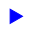
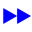

# BABS Sprite Markers

Sprite-only graphic primitives for MapLibre symbol layers. Markers have no BABS catalogue
id, no language variant, and no React export — they appear only in the sprite sheets
(`babs-de`, `babs-fr`, `babs-it`).

## Design notes

- **Ids name shape and colour, never use-case.** A chevron may serve any number of line
  types without its name going stale. The mapping from line type to marker key lives
  entirely in the downstream map style.
- **Language-neutral.** The same pixel data is baked into all three sprite sheets.
  `pixels.sha256.json` asserts this on every build.
- **`icon` mode keeps a 2 px gutter.** A rotated sampling footprint reaches outside the
  nominal 32 px box; the gutter prevents the neighbouring cell bleeding in under
  `icon-rotate`. The full-bleed `pattern` mode (36 px, no gutter) is reserved for
  seamlessly-tiling line fills.
- **Colour variants are baked.** MapLibre sprites are not SDF, so `icon-color` cannot
  recolour at runtime. Each colour variant is a separate sprite key, derived in-memory
  from the same geometry by a recolour rule declared in `markers/markers.json`.
- **Add a marker:** three lines in `markers/markers.json` + one SVG in `markers/svg/`.
  A colour-derived variant is three lines in the manifest with no SVG.
  Run `yarn icons:rebuild && yarn icons:verify` to regenerate.

## Sprite key helper

```ts
import { markerSpriteKey } from "@f-eld-ch/babs-core";

// Returns "marker-chevron-blue" (typed as `marker-${BabsMarkerId}`)
markerSpriteKey("chevron-blue");
```

## Marker reference

| Geometry                                                                                            | Sprite key                   | Mode | Recolour    | Notes                                                                    |
| --------------------------------------------------------------------------------------------------- | ---------------------------- | ---- | ----------- | ------------------------------------------------------------------------ |
|                | `marker-chevron-blue`        | icon | —           |                                                                          |
|                 | `marker-chevron-red`         | icon | #00f → #f00 | Geometry shared with `chevron-blue`. Colour baked — sprites are not SDF. |
|  | `marker-double-chevron-blue` | icon | —           |                                                                          |

---

_Generated by `yarn icons:docs` — do not edit manually._
